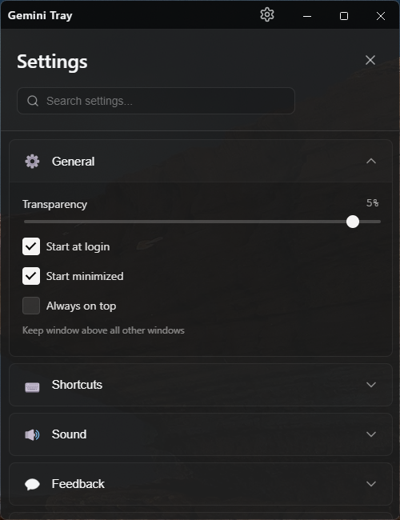
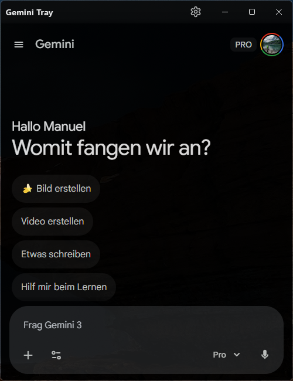

# Gemini Tray 

**Bring the power of Google Gemini directly to your desktop workflow.**

Gemini Tray is a lightweight, system-tray application that wraps the Google Gemini web interface, making it instantly accessible via global shortcuts. It bridges the gap on the desktop where a dedicated app is missing, providing a seamless experience similar to Spotlight or native AI tools.



##  Why Gemini Tray?

Unlike ChatGPT, Google currently does not offer a standalone desktop application for Gemini. Users are forced to keep a browser tab open, which can get lost or cluttered. 

**Gemini Tray solves this by:**
*   Running quietly in the background (System Tray).
*   Being "Always On Top" when you need it.
*   Integrating directly with `gemini.google.com` (no API keys required, supports Advanced accounts).
*   **Essential Feature**: Providing a dedicated "Screenshot & Ask" workflow to quickly analyze screen content.

## Vibe Coded
This project is 100% vibe coded.
Built with Google Antigravity and Gemini 3.


##  Key Features

- ** Instant Access**: Open the chat anytime with a global shortcut (Default: `Alt+Space` or similar, configurable).
- ** Screenshot & Ask**: The "Killer Feature". Trigger a snipping tool, capture any part of your screen (or full screen), and it's practically instantly attached to a fresh Gemini prompt. Perfect for questions like *"What does this error mean?"* or *"Explain this code snippet."*
- ** Full Web Experience**: Uses the official web interface, so you get all features (image generation, extensions, history) without API cost or limitations.
- ** Configurable**: Settings to customize shortcuts, "Always on Top" behavior, opacity, and more.



## 🎬 Demo


### Schnellstart mit Shortcuts & Prompts

So nutzt du GeminiTray am effektivsten:

1. **App öffnen**: Drücke `Alt+Space` (oder deinen eigenen Shortcut) – die App erscheint sofort über allen Fenstern.

2. **Screenshot-Analyse** (die Killer-Funktion): 
   - Drücke `Alt+Shift+S` → Bildschirmbereich auswählen → Bild wird direkt in ein neues Gemini-Prompt eingefügt.
   - Beispiele:
     - **Fehlermeldungen**: Screenshot machen + Prompt: *"Was bedeutet dieser Fehler?"*
     - **Code-Analyse**: Code-Screenshot + Prompt: *"Erkläre mir diesen Code"*
     - **UI-Design**: Design-Screenshot + Prompt: *"Wie baue ich diese Komponente in React?"*

3. **Schnelle Prompts**:
   - `Strg+N` → Neues Gespräch starten
   - `Esc` → Fenster minimieren (läuft weiter im Tray)

**Pro-Tipp**: Nutze die "Always on Top"-Funktion für durchgehende Assisstenz beim Arbeiten.

##  Installation & Updates

### Download
You can download the latest version from the **[GitHub Releases](https://github.com/YourUsername/gemini-tray/releases)** page.

The application is built and published automatically via **GitHub Actions** whenever a new version is tagged.

###  Note on Updates
**This application does NOT have an auto-update mechanism.** 
New features are not pushed to you automatically. You have full control over when to upgrade by simply downloading a newer installer from the Releases page.

##  Manual Build Instructions

If you prefer to build the application from source yourself, follow these steps:

### Prerequisites
*   [Node.js](https://nodejs.org/) installed on your machine.
*   Git.

### Steps

1.  **Clone the repository**:
    ```bash
    git clone https://github.com/YourUsername/gemini-tray.git
    cd gemini-tray
    ```

2.  **Install dependencies**:
    ```bash
    npm install
    ```

3.  **Build the application**:
    
    For Windows:
    ```bash
    npm run build:win
    ```
    
    For Linux:
    ```bash
    npm run build:linux
    ```

4.  **Locate the executable**:
    The installer/executable will be generated in the `dist` or `release` folder (depending on configuration).

---

*Note: This is an unofficial community project and is not affiliated with Google. Its just a Electron web Browser wrapper for the Gemini Web Interface.*
